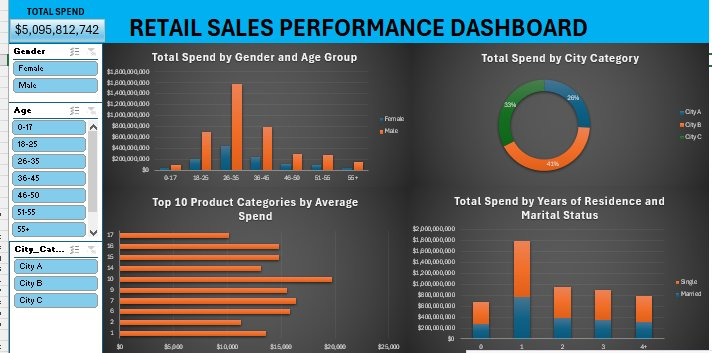

# 🛍️ Retail Sales Performance Analysis — Black Friday Dataset


An end-to-end retail analytics project that transforms **550,068 raw Black Friday transactions** into a decision-ready, interactive sales dashboard — covering data ingestion, integrity checks, standardization, exploratory analysis, and visualization.

---

## Table of Contents

- [Project Summary](#-project-summary)
- [Business Questions](#-business-questions)
- [Dataset](#-dataset)
- [Tech Stack](#-tech-stack)
- [Methodology](#-methodology)
  - [1. Ingestion](#1-ingestion)
  - [2. Data Integrity Check](#2-data-integrity-check)
  - [3. Standardization Layer](#3-standardization-layer)
  - [4. Exploratory Data Analysis](#4-exploratory-data-analysis)
  - [5. Export](#5-export)
- [Dashboard](#-dashboard)
- [Key Insights](#-key-insights)
- [Repository Structure](#-repository-structure)
- [How to Reproduce](#-how-to-reproduce)
- [Author](#-author)

---

## 📋 Project Summary

A US-based retail chain's Black Friday transaction log was analyzed to understand **customer spending behavior across demographics, geography, and product categories**. The raw CSV was loaded into MySQL, validated for duplicates, standardized into an analysis-ready view, and queried across nine dimensions to surface spend, frequency, and average-order-value patterns. Findings were visualized in a filterable Excel dashboard for stakeholders without SQL access.

| Metric | Value |
|---|---|
| Transactions analyzed | **550,068** |
| Total spend | **$5,095,812,742** |
| Unique customers | **5,891** |
| Duplicate records found | **0** |
| Dimensions analyzed | Gender, Age, Occupation, City Category, Residency Tenure, Marital Status, Product Category |

---

## ❓ Business Questions

This analysis was designed to answer:

1. Which customer segments (gender, age, marital status) drive the most revenue?
2. Which city categories and occupations contribute most to total spend?
3. Which products and product categories have the highest sales volume vs. highest average order value?
4. How does customer tenure in a city correlate with spending?
5. Who are the highest-value customers, and what does the long tail of spend look like?

---

## 🗃️ Dataset

**Source file:** `Black Friday Dataset.csv`
**Staging table:** `black_friday_sales` → **Analysis view:** `blackfriday_sales`

| Column | Type | Description |
|---|---|---|
| `User_ID` | int | Unique customer identifier |
| `Product_ID` | varchar(20) | Unique product identifier |
| `Gender` | varchar(10) | `f`/`m` → decoded to `Female`/`Male` |
| `Age` | varchar(10) | Age bracket, e.g. `26-35` |
| `Occupation` | int | Occupation code (anonymized) |
| `City_Category` | varchar(3) | `A`, `B`, or `C` |
| `Stay_in_Current_City_Years` | varchar(5) | Years resident in current city |
| `Marital_Status` | int | `0`/`1` → decoded to `Single`/`Married` |
| `Product_Category_1` | int | Primary product category |
| `Product_Category_2` | int, nullable | Secondary product category |
| `Product_Category_3` | int, nullable | Tertiary product category |
| `Purchase` | int | Transaction amount (USD) |

> **Data quality note:** `Product_Category_2` and `Product_Category_3` contained blank strings rather than true nulls in the raw file. These were converted to proper `NULL` values at load time using MySQL staging variables (`@variable1`, `@variable2`), avoiding silent miscounts in later aggregations.

---

## 🛠️ Tech Stack

| Layer | Tool | Purpose |
|---|---|---|
| Storage & Processing | **MySQL 8.0** | Bulk load, deduplication, standardization, aggregation |
| Analysis | **Window Functions** (`ROW_NUMBER()`) | Integrity checks |
| Abstraction | **SQL Views** | Reusable, decoded analysis layer |
| Visualization | **Microsoft Excel** | Pivot tables, slicers, KPI cards, charts |

---

## 🧪 Methodology

### 1. Ingestion

The raw CSV is bulk-loaded via `LOAD DATA INFILE`, with empty-string category fields converted to `NULL` inline using session variables:

```sql
create table black_friday_sales (
  User_ID int, Product_ID varchar(20), Gender varchar(10), Age varchar(10),
  Occupation int, City_Category varchar(3), Stay_in_Current_City_Years varchar(5),
  Marital_Status int, Product_Category_1 int, Product_Category_2 int null,
  Product_Category_3 int null, Purchase int
);

load data infile 'Black Friday Dataset.csv' into table black_friday_sales
fields terminated by ','
ignore 1 rows
(User_id, Product_id, Gender, Age, Occupation, City_Category,
 Stay_in_Current_City_Years, Marital_Status, Product_Category_1,
 @variable1, @variable2, Purchase)
set Product_Category_2 = if(@variable1 = '', null, @variable1),
    Product_Category_3 = if(@variable2 = '', null, @variable2);
```

**How this works:**
- `CREATE TABLE` defines the structure the CSV will be loaded into — column names, data types, and which columns (`Product_Category_2`/`3`) are allowed to hold `NULL`, since not every transaction has a secondary or tertiary product category.
- `LOAD DATA INFILE` reads the CSV directly into MySQL, which is far faster than inserting row-by-row. `FIELDS TERMINATED BY ','` tells MySQL the file is comma-separated, and `IGNORE 1 ROWS` skips the header row.
- The column list in parentheses maps each CSV field to a table column **in file order**. Critically, the 10th and 11th CSV columns aren't loaded straight into `Product_Category_2`/`3` — they're captured into temporary variables `@variable1` and `@variable2` instead.
- That's because the raw CSV stores missing category values as **empty strings (`''`)**, not true `NULL`s. The `SET` clause checks each variable: if it's an empty string, the column is set to `NULL`; otherwise the actual value is kept. Without this step, `AVG()`/`COUNT()` later would treat `''` as a real value instead of "missing," silently skewing category-level results.

### 2. Data Integrity Check

Before any analysis, the table is checked for exact duplicate transactions — rows where every single column matches another row. If duplicates exist and go unnoticed, every `SUM()` and `AVG()` run later would be inflated, so this check has to happen first.

```sql
with cte1 as (
  select *, row_number() over (
    partition by User_id, Product_id, Gender, Age, Occupation, City_Category,
    Stay_in_Current_City_Years, Marital_Status, Product_Category_1,
    Product_Category_2, Product_Category_3, Purchase
  ) as row_num
  from black_friday_sales
)
select * from cte1 where row_num > 1;
```

**How this works:**
- `ROW_NUMBER() OVER (PARTITION BY ...)` groups rows that are identical across **every** column (the full column list in `PARTITION BY`) and numbers them `1, 2, 3...` within each group.
- A truly unique row will always be numbered `1`, since there's nothing else in its group.
- Any row numbered `2` or higher means MySQL found another row elsewhere in the table with the exact same values in all 12 columns — i.e., a duplicate of an earlier row.
- The CTE (`cte1`) calculates this numbering for the whole table without modifying it, and the final `SELECT ... WHERE row_num > 1` filters down to just the duplicates, if any exist.

> ✅ **Result: 0 rows returned.** No row number exceeded 1, meaning no two transactions in the dataset are fully identical. The dataset is confirmed free of duplicates, so all downstream totals are reliable.

### 3. Standardization Layer

Rather than decoding `Gender` and `Marital_Status` in every query, a single view centralizes that logic — a one-time transformation that every subsequent query and the dashboard both rely on:

```sql
create view blackfriday_sales as
select User_ID, Product_ID,
  case when gender = 'f' then 'Female' when gender = 'm' then 'Male' end Gender,
  Age, Occupation, City_Category, Stay_in_Current_City_Years,
  case when Marital_Status = 0 then 'Single' when Marital_Status = 1 then 'Married' end Marital_Status,
  Product_Category_1, Product_Category_2, Product_Category_3, Purchase
from black_friday_sales;
```

**How this works:**
- `CREATE VIEW` saves this `SELECT` statement as a virtual table named `blackfriday_sales`. It doesn't duplicate any data — every time the view is queried, MySQL runs the underlying logic fresh against the live `black_friday_sales` table.
- The raw table stores `Gender` as `'f'`/`'m'` and `Marital_Status` as `0`/`1`, which are efficient to store but not human-readable. Two `CASE WHEN` expressions translate these codes into `'Female'`/`'Male'` and `'Single'`/`'Married'` at query time.
- All other columns pass through unchanged.
- The benefit: every EDA query and the Excel dashboard can simply `SELECT FROM blackfriday_sales` and get readable labels automatically, instead of repeating the same `CASE` logic — and translating, decoding — in 25+ separate queries.

### 4. Exploratory Data Analysis

Each dimension below was analyzed with three consistent metrics — **total spend** (`SUM`), **average order value** (`AVG`), and **transaction frequency** (`COUNT`) — to distinguish *high-volume* segments from *high-value* ones.

| Dimension | Question Answered |
|---|---|
| **Customer** | Who are the top 10 spenders? |
| **Product** | Which products sell the most units? |
| **Gender** | Do men or women spend more, on average and in total? |
| **Age Group** | Which age brackets drive revenue vs. order size? |
| **Occupation** | Which occupation codes over-index on spend? |
| **City Category** | Which city tier contributes most revenue? |
| **Residency Tenure** | Does length of stay in a city affect spend? |
| **Marital Status** | Do single or married customers spend more? |
| **Product Category** | Which categories have the highest unit price vs. volume? |

Example — average order value by age group:

```sql
select age, avg(purchase) average_purchase from blackfriday_sales
group by age
order by average_purchase desc;
```

**How this works:**
- `GROUP BY age` collapses all 550,068 individual transactions down to one row per age bracket.
- `AVG(purchase)` then calculates the mean transaction value **within each group** — i.e., for every age bracket, "if you bought something, how much did you typically spend per purchase?"
- `ORDER BY average_purchase DESC` sorts brackets from highest to lowest average order value, surfacing which age group tends to make the priciest individual purchases.
- The same structure (`GROUP BY <dimension>` + an aggregate function) is reused with `SUM()` to get **total revenue per group**, and `COUNT()` to get **number of transactions per group**. Running all three against the same dimension separates *how much total revenue a group brings in* from *how big their average purchase is* from *how often they buy* — three different stories that a single query can't tell on its own.

> The complete set of 25+ queries (sum/avg/count across every dimension) is in [`black_friday_analysis.sql`](./black_friday_analysis.sql).

### 5. Export

The cleaned, decoded dataset is exported for downstream BI tools:

```sql
SELECT User_ID, Product_ID, Gender, Age, Occupation, City_Category,
       Stay_In_Current_City_Years, Marital_Status, Product_Category_1,
       Product_Category_2, Product_Category_3, Purchase
FROM blackfriday_sales
INTO OUTFILE 'clean_black_friday.csv'
FIELDS TERMINATED BY ','
LINES TERMINATED BY '\n';
```

**How this works:**
- This query selects every column from the `blackfriday_sales` view — meaning it pulls the **already-decoded, already-cleaned** version of the data (readable `Gender`/`Marital_Status` labels, proper `NULL`s), not the raw staging table.
- `INTO OUTFILE` writes the result set directly to a `.csv` file on the MySQL server's filesystem, rather than just returning it to the query console.
- `FIELDS TERMINATED BY ','` and `LINES TERMINATED BY '\n'` define the output format, so the resulting file is a standard comma-separated CSV that Excel can open and build pivot tables from directly — this is the file the dashboard's pivot tables are ultimately built on.

---

## 📊 Dashboard



An interactive Excel dashboard built on the cleaned dataset, allowing non-technical stakeholders to filter and explore spend patterns live.

| Component | Detail |
|---|---|
| KPI card | Total Spend across all transactions |
| Slicers | Gender, Age, City Category |
| Chart 1 | Total Spend by Gender and Age Group (clustered bar) |
| Chart 2 | Total Spend by City Category (donut) |
| Chart 3 | Top 10 Product Categories by Average Spend (bar) |
| Chart 4 | Total Spend by Years of Residence and Marital Status (stacked bar) |

---

## 🔎 Key Insights

- **Total spend across all 550,068 transactions is $5,095,812,742.**
- **Male customers account for ~76.7% of total spend ($3.91B)** vs. **~23.3% for female customers ($1.19B)** — a far wider gap than population splits alone would suggest, pointing to either higher male transaction frequency, higher-value purchases, or both.
- The **26-35 age group is the single largest revenue driver**, contributing **~39.9% of total spend ($2.03B)** — more than double the next-closest bracket (36-45, $1.03B).
- **City Category B leads all city tiers**, generating **41.5% of total spend ($2.12B)**, ahead of City C (32.7%, $1.66B) and City A (25.8%, $1.32B) — despite B not being the largest city tier by typical urban-center assumptions, suggesting B-tier cities over-index on retail spend per capita.
- The **top single customer (User ID 1004277) spent $10.5M** — over 2,000x the dataset's average transaction value — highlighting a long-tail customer base where a small number of high-frequency or bulk buyers contribute disproportionately.
- **Single customers with 1 year of residency in their current city** form the largest segment in the residency/marital-status breakdown, suggesting relocation or new-household setup may be a meaningful spend driver worth deeper segmentation.

---

## 📁 Repository Structure

```
.
├── README.md                              # This file
├── black_friday_analysis.sql              # Full MySQL pipeline: load → clean → EDA → export
├── Peter_s_black_friday_full_project.xlsx # Cleaned data, pivot tables, dashboard
└── black_friday_dashboard.PNG             # Dashboard screenshot
```

---

## ▶️ How to Reproduce

1. Download the [Black Friday dataset](https://www.kaggle.com/datasets/sdolezel/black-friday) (or your own copy of the source CSV).
2. Run [`black_friday_analysis.sql`](./black_friday_analysis.sql) against a MySQL 8.0+ instance (update the `LOAD DATA INFILE` path to your local file location; `secure_file_priv` and `local_infile` may need to be configured).
3. Open [`Peter_s_black_friday_full_project.xlsx`](./Peter_s_black_friday_full_project.xlsx) and refresh the pivot tables against the exported `clean_black_friday.csv`, or point them at your own query results.

---

## 👤 Author

**Peter Uwaechue** — Data Analyst
*Tools: SQL (MySQL) · Excel · Data Cleaning · Exploratory Data Analysis · Dashboarding*
